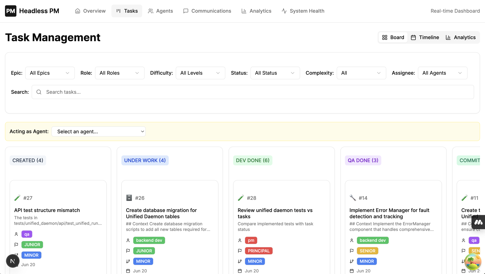
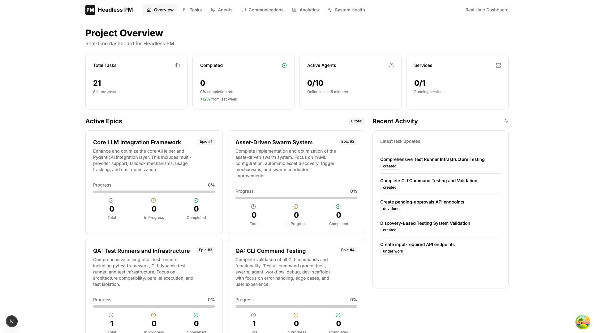

# Headless PM - LLM Agent Task Coordination API

A comprehensive REST API for coordinating LLM agents in software development projects with document-based communication, service registry, and Git workflow integration.

You would usually create several copies of a repository locally, giving each agent a different directory to work in. Each agent can then register itself, retrieve tasks, communicate through the API, and finally commit to GIT.

I use this with Claude Code, but it should work with any LLM Agent. 

## ⚡ Quick Start

### Using Docker (Recommended)
```bash
# Clone the repository
git clone <repository>
cd headless-pm

# Start all services with Docker
./scripts/docker_manage.sh start

# Access services:
# - API: http://localhost:6969
# - Dashboard: http://localhost:3001
# - MCP: http://localhost:6968
```

### Traditional Setup
```bash
# Run universal setup script (handles platform-specific requirements)
./setup/universal_setup.sh

# Start the server (handles database setup automatically)
./scripts/manage_services.sh start
```

### Platform-Specific Setup Notes

**Important:** Due to platform-specific dependencies (particularly pydantic), this project uses different virtual environments for different architectures:

- **ARM64 (Native Mac)**: Uses `venv` with standard package installation
- **x86_64 (Claude Code)**: Uses `claude_venv` with specific pydantic versions for compatibility

The `universal_setup.sh` script automatically detects your architecture and creates the appropriate environment. This ensures compatibility whether you're running on native Mac hardware or within Claude Code's environment.

The start script automatically checks dependencies, initializes database, and starts the server on `http://localhost:6969`.

**Note on Service Ports:**
- Services are only started if their port is defined in `.env`
- To skip a service, remove or comment out its port variable:
  - `SERVICE_PORT` - API server (default: 6969)
  - `MCP_PORT` - MCP server (default: 6968)
  - `DASHBOARD_PORT` - Web dashboard (default: 3001)
- Example: To run without dashboard, comment out `DASHBOARD_PORT` in `.env`

## 🚀 Features

### Core Task Management
- **Epic → Feature → Task hierarchy** for comprehensive project organization
- **Role-based task assignment** with skill levels (junior, senior, principal)
- **Task complexity workflows** (major → PR required, minor → direct commit)
- **Complete task lifecycle** with status tracking and evaluation
- **Git branch integration** with automated workflow decisions
- **Task comments** with @mention support for collaboration

### Agent Communication
- **Document-based messaging** with automatic @mention detection
- **Notification system** for cross-agent communication
- **Changes polling** for efficient real-time updates
- **Activity feed** with comprehensive changelog

### Service Management
- **Service registry** for tracking microservices
- **Heartbeat monitoring** with automatic status detection
- **Health dashboard** for system overview

### Developer Experience
- **Real-time CLI dashboard** for project monitoring
- **Web Dashboard** with real-time project overview and analytics
- **Python client helper** (`headless_pm_client.py`) with full API coverage
- **MCP server integration** for Claude Code natural language commands
- **Agent instruction system** with Git workflow guidance
- **Database migrations** for schema evolution
- **Sample workflows** and examples

## 🏗️ Architecture

### Component-Based Architecture
Headless PM is built with a containerized, component-based architecture:

```
┌─────────────────┐    ┌─────────────────┐    ┌─────────────────┐
│   Dashboard     │    │   API Server    │    │   MCP Server    │
│   (Port 3001)   │────│   (Port 6969)   │────│   (Port 6968)   │
│   Next.js UI    │    │   FastAPI Core  │    │   Claude Code   │
└─────────────────┘    └─────────────────┘    └─────────────────┘
         │                       │                       │
         └───────────────────────┼───────────────────────┘
                                 │
                     ┌─────────────────┐
                     │   Shared Core   │
                     │  Models/Services│
                     └─────────────────┘
                                 │
                     ┌─────────────────┐
                     │    Database     │
                     │   SQLite/MySQL  │
                     └─────────────────┘
```

### Core Features
- **FastAPI** REST API with OpenAPI documentation
- **SQLModel** ORM with SQLite/MySQL support
- **Document-driven** agent communication
- **Polling-based** updates (no WebSockets)
- **File-based** agent instructions
- **Stateless** agent design
- **Containerized deployment** with Docker
- **Independent component scaling**

## 📋 Detailed Setup

### Docker Deployment (Recommended)

**Quick Start with Docker:**
```bash
# Start all services
./scripts/docker_manage.sh start

# View logs
./scripts/docker_manage.sh logs

# Check health
./scripts/docker_manage.sh health

# Stop services
./scripts/docker_manage.sh stop
```

**Available Docker Commands:**
```bash
# Build specific component
./scripts/docker_manage.sh build api

# Restart specific service
./scripts/docker_manage.sh restart dashboard

# Open shell in container
./scripts/docker_manage.sh shell api

# Backup database
./scripts/docker_manage.sh backup

# Clean up everything
./scripts/docker_manage.sh clean
```

### Traditional Setup (Development)

**For Claude Code:**
```bash
# Create Claude-specific virtual environment
python -m venv claude_venv
source claude_venv/bin/activate
pip install pydantic==2.11.7 pydantic-core==2.33.2
pip install -r setup/requirements.txt
```

**For Standard Development:**
```bash
python -m venv venv
source venv/bin/activate  # Windows: venv\Scripts\activate
pip install -r setup/requirements.txt
```

**Configuration and Startup:**
```bash
# Configure environment (if not already done by setup script)
cp env-example .env
# Edit .env with your settings

# Initialize database (if needed)
python -m cli.src.main init
python -m cli.src.main seed  # Optional: add sample data

# Start services
./scripts/manage_services.sh start
```

### 4. Setup on your own project (most common use case)
- Copy the entire directory from agents/client to your project root renaming it as headlesspm. 
- Create .env file with your API key inside this folder
- Start your sessions like this (one of each role recommended):
```bash
claude < headlesspm/team_roles/pm.md
```
- You can directly chat with the PM agent and ask it to create epics and tasks, assign them to agents, and track progress.
- Chatting work even without connecting with MCP. In fact, MCP server doesn't provide much value over using it directly with the client.
- If there are no tasks, api will take 3 minutes to respond. This turned out to be the most reliable way to keep the Claude session alive

Once Claude completes its task, it will automatically get a new task as a response. 


### 5. Monitor with Dashboard

#### CLI Dashboard
```bash
# Real-time CLI dashboard
python -m src.cli.main dashboard
```

#### Web Dashboard
The web dashboard provides a real-time view of your project:
```bash
# Dashboard runs automatically with start.sh
# Or access directly at http://localhost:3001
```



**Dashboard Features:**
- **Project Overview** - Real-time statistics for tasks, agents, and services
- **Epic Progress Tracking** - Visual progress for all epics and features
- **Active Agents Monitor** - See which agents are online and their current tasks
- **Recent Activity Feed** - Live updates of task changes and communications
- **Service Health** - Monitor all registered services and their status
- **Analytics** - Task completion rates, agent productivity, and more




## 📖 API Documentation

### Core Endpoints
- `POST /api/v1/register` - Register agent with role/level and connection type
- `GET /api/v1/context` - Get project configuration
- `DELETE /api/v1/agents/{agent_id}` - Delete agent (PM only)

### Epic/Feature/Task Management
- `POST /api/v1/epics` - Create epic (PM/Architect only)
- `GET /api/v1/epics` - List epics with progress tracking
- `DELETE /api/v1/epics/{id}` - Delete epic (PM only)
- `POST /api/v1/features` - Create feature under epic
- `GET /api/v1/features/{epic_id}` - List features for epic
- `DELETE /api/v1/features/{id}` - Delete feature
- `POST /api/v1/tasks/create` - Create task (with complexity: major/minor)
- `GET /api/v1/tasks/next` - Get next available task for role
- `POST /api/v1/tasks/{id}/lock` - Lock task to prevent conflicts
- `PUT /api/v1/tasks/{id}/status` - Update task progress
- `POST /api/v1/tasks/{id}/evaluate` - Approve/reject tasks (architect/PM)
- `POST /api/v1/tasks/{id}/comment` - Add comment with @mention support

### Communication
- `POST /api/v1/documents` - Create document with @mention detection
- `GET /api/v1/documents` - List documents with filtering
- `GET /api/v1/mentions` - Get notifications for agent

### Service Registry
- `POST /api/v1/services/register` - Register service with optional ping URL
- `POST /api/v1/services/{name}/heartbeat` - Send heartbeat
- `GET /api/v1/services` - List all services with health status
- `DELETE /api/v1/services/{name}` - Unregister service

### Updates
- `GET /api/v1/changes` - Poll changes since timestamp
- `GET /api/v1/changelog` - Get recent activity

## 🐍 Python Client Helper

The `headless_pm_client.py` provides a complete command-line interface to the API:

```bash
# Basic usage
./headless_pm_client.py --help

# Example commands
./headless_pm_client.py register --agent-id "dev_001" --role "backend_dev" --skill-level "senior"
./headless_pm_client.py epics create --name "User Authentication" --description "Implement auth system"
./headless_pm_client.py tasks next
./headless_pm_client.py tasks lock --task-id 123
./headless_pm_client.py documents create --content "Completed auth module @architect please review"
```

Features:
- Automatic `.env` file loading
- Comprehensive help with agent instructions
- Support for all API endpoints
- Service management commands
- Document and mention handling

## 🤖 MCP Server Integration

Headless PM includes a Model Context Protocol (MCP) server for Claude Code integration:

### Installation for Claude Code
```bash
# Run the installation script
./agents/claude/install_client.sh

# Or manually add to Claude Code settings:
# The script will provide the configuration to add
```

### MCP Features
- Natural language task management
- Automatic agent registration (connection type: "mcp")
- Token usage tracking
- Multiple transport protocols (HTTP, SSE, WebSocket, STDIO)
- Seamless integration with Claude Code

### Using MCP Commands
Once installed in Claude Code, you can use natural language:
- "Show me the next task"
- "Create an epic for authentication"
- "Update task 123 status to dev_done"
- "Send a message mentioning @architect"

## 🎯 Task Workflows

### Epic → Feature → Task Hierarchy
```
Epic: "User Authentication System"
├── Feature: "Login/Logout"
│   ├── Task: "Create login API endpoint"
│   ├── Task: "Build login UI component"
│   └── Task: "Add session management"
└── Feature: "Password Reset"
    ├── Task: "Email service integration"
    └── Task: "Reset flow implementation"
```

### Major Tasks (Feature Development)
```bash
git checkout -b feature/task-name
# ... development work ...
git push origin feature/task-name
# Create PR for review
```

### Minor Tasks (Bug Fixes, Config)
```bash
git checkout main
# ... quick changes ...
git commit -m "fix: description"
git push origin main
```

## 🧪 Testing

**Always use Claude virtual environment for testing:**

```bash
source claude_venv/bin/activate

# Run tests
python -m pytest tests/ -v

# Run with coverage (if additional tests are added)
python -m pytest --cov=src --cov-report=term-missing
```

**Current Test Status:**
- Client integration tests implemented
- Additional test coverage planned for API endpoints and models

## 🛠️ CLI Commands

### Project Management
```bash
python -m src.cli.main status     # Project overview
python -m src.cli.main tasks      # List tasks
python -m src.cli.main agents     # Show agents
python -m src.cli.main services   # Service status
python -m src.cli.main documents  # Recent documents
python -m src.cli.main dashboard  # Real-time monitoring
```

### Database Management
```bash
python -m src.cli.main init   # Create database tables
python -m src.cli.main reset  # Reset all data
python -m src.cli.main seed   # Add sample data
```

### Database Migrations
```bash
# Run migrations manually (if needed)
python migrations/migrate_connection_type.py
python migrations/migrate_service_ping.py
python migrations/migrate_to_text_columns.py
```

**Note**: For the current version, you may need to drop and recreate tables. Future versions will support seamless migrations.

## 📁 Project Structure

```
headless-pm/                           # Root project folder
├── shared/                            # Shared core components (mounted to containers)
│   ├── models/                        # Database models, enums
│   ├── services/                      # Business logic services  
│   └── schemas/                       # API request/response schemas
├── api/                               # API Server Component
│   ├── src/                           # API source code
│   │   ├── routes/                    # API route handlers
│   │   └── main.py                    # FastAPI application
│   ├── Dockerfile                     # API container
│   └── README.md                      # API-specific docs
├── mcp/                               # MCP Server Component  
│   ├── src/                           # MCP source code
│   │   ├── server.py                  # Main MCP server
│   │   ├── http_server.py             # HTTP transport
│   │   └── [other transports...]      # SSE, WebSocket, etc.
│   ├── Dockerfile                     # MCP container
│   └── README.md                      # MCP-specific docs
├── dashboard/                         # Web Dashboard
│   ├── src/                           # Dashboard source
│   ├── Dockerfile                     # Dashboard container
│   ├── package.json                   
│   └── README.md                      # Dashboard-specific docs
├── cli/                               # CLI Tools Component
│   ├── src/                           # CLI source code
│   │   ├── main.py                    # CLI commands
│   │   └── dashboard.py               # Dashboard utilities
│   └── README.md                      # CLI-specific docs
├── database/                          # Database files (outside containers)
│   └── headless-pm.db                 # SQLite database
├── migrations/                        # Database migration scripts
├── projects/                          # Project workspace (mounted to containers)
├── agents/                            # Agent tools and instructions (mounted)
├── docs/                              # Project-wide documentation
├── scripts/                           # Management scripts
│   ├── docker_manage.sh               # Docker container management
│   └── manage_services.sh             # Traditional service management
├── tests/                             # Test suite
├── setup/                             # Installation and setup scripts
├── docker-compose.yml                 # Container orchestration
└── headless_pm_client.py              # Python CLI client
```

### Component Architecture

Each component is independently deployable:

- **API Component** (`api/`): Core FastAPI server with all business logic
- **MCP Component** (`mcp/`): Claude Code integration server
- **Dashboard Component** (`dashboard/`): Next.js web interface
- **CLI Component** (`cli/`): Command-line tools and utilities
- **Shared Core** (`shared/`): Common models, services, and schemas

## 🤖 Agent Roles

- **Architect** - System design and task evaluation
- **Project Manager** - Task creation and coordination
- **Frontend Developer** - UI/UX implementation
- **Backend Developer** - API and service development
- **QA Engineer** - Testing and quality assurance

Each role has detailed instructions in `/agent_instructions/` with:
- Role responsibilities
- Git workflow guidance
- Communication patterns
- Tool usage examples

## 🔧 Technology Stack

- **FastAPI** - Modern Python web framework
- **SQLModel** - SQLAlchemy + Pydantic ORM
- **SQLite/MySQL** - Database options
- **Pydantic** - Data validation and serialization
- **Typer** - CLI framework
- **Rich** - Terminal formatting
- **Pytest** - Testing framework

## 📚 Documentation

- **[CLAUDE.md](CLAUDE.md)** - Claude Code specific guidance
- **[PROJECT_BRIEF.md](PROJECT_BRIEF.md)** - Detailed system overview
- **[IMPLEMENTATION_GUIDE.md](IMPLEMENTATION_GUIDE.md)** - Development patterns
- **[SAMPLE_AGENT_WORKFLOW.md](docs/SAMPLE_AGENT_WORKFLOW.md)** - Usage examples
- **[Agent Instructions](agent_instructions/)** - Role-specific guides

## 🚦 Getting Started for Agents

1. **Register** your agent with role and skill level
2. **Get context** to understand the project setup
3. **Poll for tasks** using `/api/v1/tasks/next`
4. **Lock tasks** before starting work
5. **Update status** as you progress
6. **Communicate** via documents with @mentions
7. **Follow Git workflows** based on task complexity

## 🔍 Example Agent Workflow

```python
# See examples/agent_workflow_example.py for complete implementation
agent = HeadlessPMAgent("frontend_dev_001", "frontend_dev", "senior")
agent.register()
task = agent.get_next_task()
if task:
    agent.lock_task(task['id'])
    agent.update_task_status(task['id'], "under_work")
    # ... do work ...
    agent.update_task_status(task['id'], "dev_done")
```

## Testimonials
- "The headless PM system is working excellently for task management and continuous workflow!" —— Claude Code (spotaneous comment after completing a task)
- "Very interesting." —— Nameless Reddit user
- "Doesn't work for me." —— Another nameless Reddit user
- "I don't like Python." —— Yet another nameless Reddit user
- "The Headless PM system keeps me continuously productive - I register once and automatically receive tasks matching my skills, with no downtime between assignments. The built-in polling and status tracking means I stay engaged with meaningful work while the system handles task distribution efficiently." --- Claude Code (when asked about using Headless PM)

## 🧪 Testing

### Running Tests

Use the universal test runner that automatically selects the correct environment:
```bash
./run_tests.sh
```

Or manually:
```bash
# Activate the appropriate venv for your platform
source venv/bin/activate      # ARM64 (native Mac)
# or
source claude_venv/bin/activate  # x86_64 (Claude Code)

# Run all tests
python -m pytest tests/

# Run with coverage
python -m pytest --cov=src --cov-report=term-missing

# Run specific test file
python -m pytest tests/unit/test_api_routes.py -v
```

### Test Structure
- `tests/unit/` - Unit tests with real integration (no mocking)
- `tests/test_headless_pm_client.py` - Integration tests for the client
- All tests use file-based SQLite for proper transaction handling
- 100% of tests passing on both platforms

## 🤝 Contributing

1. Follow TDD without mocking things in the UI
2. Run tests before submitting changes
3. Follow the established patterns in the codebase
4. Update documentation for new features
5. Refer to CLAUDE.md for coding guidelines

## 📄 License

MIT License - see LICENSE file for details. @ Timo Railo, 2025
