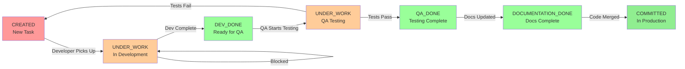

# Task Status Flow Diagram

## Complete Status Flow



## Role-Specific Views

### Architect/PM View
```
CREATED → UNDER_WORK → DEV_DONE → [Wait for QA] → COMMITTED
```
- Pick up CREATED tasks like any developer
- Also can create epics, features, and manage other agents

### Developer View (Frontend/Backend)
```
CREATED → UNDER_WORK → DEV_DONE → [Wait for QA] → COMMITTED
```
- Pick up CREATED tasks matching role and skill level
- Lock before starting work
- Mark DEV_DONE when ready for testing
- Mark COMMITTED after merge

### QA View
```
DEV_DONE → UNDER_WORK → QA_DONE or CREATED (if failed)
```
- Pick up DEV_DONE tasks
- Test thoroughly
- Mark QA_DONE if passes
- Send back to CREATED if fails

## Status Ownership

| Status | Who Can Set | When to Set |
|--------|-------------|-------------|
| CREATED | Any agent | When creating a new task or QA fails testing |
| UNDER_WORK | Developer/QA | When starting work on a task |
| DEV_DONE | Developer | When code is complete and tested |
| QA_DONE | QA Engineer | When all tests pass |
| DOCUMENTATION_DONE | Developer/Tech Writer | When docs are updated |
| COMMITTED | Developer | When code is merged to main |

## Key Rules

1. **Sequential Flow**: Don't skip statuses
2. **Lock Required**: Must lock task before setting UNDER_WORK
3. **Auto Unlock**: Moving from UNDER_WORK automatically unlocks
4. **One Active**: Only one UNDER_WORK task per agent
5. **Notes Required**: Always add descriptive notes with status changes

## Common Scenarios

### Happy Path
```
CREATED → UNDER_WORK → DEV_DONE → QA_DONE → DOCUMENTATION_DONE → COMMITTED
```

### QA Finds Bugs
```
DEV_DONE → UNDER_WORK (QA) → CREATED → UNDER_WORK (Dev) → DEV_DONE
```

### Senior Dev Takes Junior Task (No Junior Devs Available)
```
CREATED (junior task) → UNDER_WORK (senior dev) → DEV_DONE → QA_DONE → COMMITTED
```

### Developer Blocked
```
UNDER_WORK → [Create blocking issue] → [Resolve] → DEV_DONE
```

## API Examples

### Check Current Status
```bash
GET /api/v1/tasks/123
```

### Update Status (Developer)
```bash
PUT /api/v1/tasks/123/status?agent_id=backend_dev_001
{
  "status": "dev_done",
  "notes": "Implementation complete, 15 unit tests added, API documented"
}
```

### Lock and Start Task (Any Developer)
```bash
POST /api/v1/tasks/123/lock?agent_id=backend_dev_001
PUT /api/v1/tasks/123/status?agent_id=backend_dev_001
{
  "status": "under_work",
  "notes": "Starting implementation"
}
```